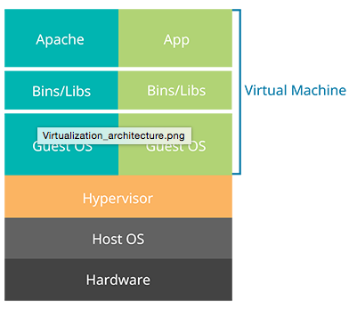
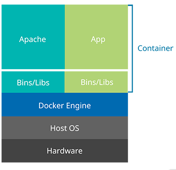

# Docker Container
Docker 是一個開源專案，支援多平台，從筆電到公、私有雲上能進行快速部署輕量、獨立的作業環境。Docker 使用Linux核心中的功能，Namespace及Control Groups(cgroups)等，來達到建置獨立的環境及控制CPU、Memory、網路等資源。

[Docker官方]( http://www.docker.com/)

# Docker Container vs 虛擬化

### 虛擬化

虛擬化通常都是透過在Host OS上安裝hypervisor，由hypervisor來管理不同虛擬主機，每個虛擬主機都需要安裝不同的作業系統。

### Docker Container
Docker 提供應用程式在獨立的Container中執行，這些Container並不需要像虛擬化一樣額外依附在hypervisor或guest OS上，是透過Docker Engine來進行管理。

# Docker 三個重要部分
### Docker Images
Image用來開啟Docker Container，但images是**唯讀**的，當我們直接結束Container 後，Container所改變的資料並不會儲存在image中，但是Docker 能對變更後的Container建立一個image。

### Docker Containers
提供獨立、安全的環境給應用程式執行，Container是從Docker image建立的，運並行在主機之上。

### Docker Registries
我們可以將Docker images上傳或下載到公開與私有的Docker Registries上，來與其他人分享公開的image，ex:[Docker Hub](https://hub.docker.com/) 就提供了許多不同的images ，諸如：Ubuntu或Ubuntu環境下安裝 Ruby on Rails的images ，只要透過網路下載，我們即可部署相對應的Container。

# 操作 Docker 方法
Docker主機上會執行一個Docker Daemon，就能夠開啟許多Container。如果要對Docker進行操作的話，可以使用Docker Client，諸如GUI的Docker [Kitematic](https://kitematic.com/)、CLI指令存取(例如：docker pull, docker images等等)，分別可以藉由：

1. [UNIX sockets](http://en.wikipedia.org/wiki/Unix_domain_socket)
2. [網路 RESTful API](http://en.wikipedia.org/wiki/Representational_state_transfer)

對主機上的Docker Daemon進行控制，當然 Docker Client與Docker Daemon 可以是同一台或不同主機上 。

[Docker Remote API - Docker Documentation](https://docs.docker.com/reference/api/docker_remote_api/)

# 參考
* [Docker 教學](http://www.openfoundry.org/tw/tech-column/9319-docker-101)
* [Docker —— 從入門到實踐](https://www.gitbook.com/book/philipzheng/docker_practice/details)

