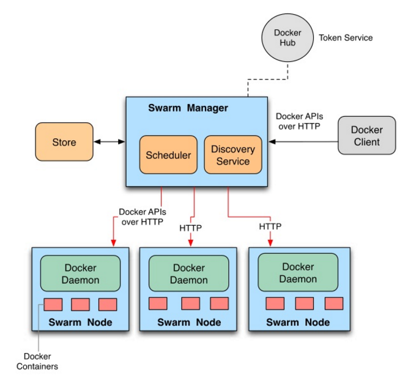

# Docker Swarm
Swarm 是 Docker 開發的容器化分散式應用程式叢集管理工具，由於隨著 Docker 的應用程式越來越多，越來越深入的關係，讓應用程式部署於單一節點上的容器已經無法負荷需求、效率等，因此叢集化工具 Swarm 誕生讓我們可以在更高的抽象層上使用 Docker，讓多台 Docker engine 節點抽象成一個叢集。

Docker Swarm 採用相容 Docker 的標準 API 介面當作呼叫的進入點，這使得所有直接呼叫 Docker API 的程式後台都能被取代成 Swarm，因為相容標準 API 介面，許多形式的 Docker client、docker_py 與 Fig、Flynn、Deis 等工具都能直接與 Swarm 溝通。

