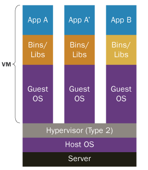
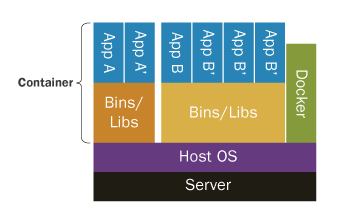

# Docker
[Docker](http://www.docker.com/) 是一個開源的專案，主要提供容器化應用程式的部署與自動化的管理，透過部署 Docker engine 於 Linux 作業系統上，提供軟體抽象層以及作業系統層虛擬化自動管理機制。Docker 使用一些 Linux Kernel 中的軟體，如 Control Groups（cgroups）、namespaces（核心命名空間）、Another UnionFS 等來達到建置獨立的環境與存取 CPU、Memory 以及網路資源等，最終提供一個輕量級的虛擬化。Docker 的發展非常迅速，從 0.9.0 版本後，採用自己開發的 Libcontainer 函式庫作為直接存取由 Linux Kernel 提供的虛擬化基礎設施。Docker 也支援了多平台，從個人電腦到私有、公有雲都能夠進行使用與部署輕量級虛擬化。
> P.S Docker 並非一個新興技術，而是過往的 Linux Container 技術的基礎上進行封裝。因此使用者只需要關注應用程式如何被部署與執行就好，而不用管容器是如何被建置出來。

使用 Docker 有以下幾項好處：
* 更快速的交付和部署
* 高效能的虛擬化環境
* 易遷移和擴展服務
* 管理簡單化
* 更有效的使用實體主機資源
* 可建置任何語言的 Dockerized 應用程式
* 跨平台的管理、部署與使用

> 微軟過往許多需要相依於 Windows 語言應用程式也慢慢被支援到 Docker 了。

### Docker Container vs 傳統虛擬化
傳統虛擬化技術一般是透過在 Host OS 上安裝 Hypervisor（VMM），然後由 Hypervisor 來管理不同虛擬主機，每個虛擬主機都需要安裝不同的作業系統，因此每個環境被獨立的完全隔離。

然而 Docker 提供應用程式在獨立的 Container 中執行，這些Container 並不需要像虛擬化一樣額外依附在 Hypervisor 甚至 Guest OS 上，而是透過 Docker engine 來進行管理。

## Docker 基本概念
Docker 擁有幾個基本概念，其中包含 Docker 三大重要部分與元件。我們將針對這些概念進行概述，也會在其他章節進一步說明。
* **Docker images**：Image（映像檔）被用來啟動容器的實際執行得應用程式環境。這概念類似 VM 的映像檔，VM 透過映像檔來啟動作業系統，並執行許多服務，但 Docker 的映像檔則只是檔案系統的儲存狀態，是一個唯讀的板模。
* **Docker containers**：Container（容器）是一個應用程式執行的實例，Docker 會提供獨立、安全的環境給應用程式執行，容器是從映像檔建立，並運作於主機上。
> P.S 盡量不要在一個 Container 執行過多的服務。

* **Docker registries**：Registries 是被用來儲存 Docker 所建立的映像檔的地方，我們可以把自己建立的映像檔透過上傳到 Registries 來分享給其他人。Registries 也被分為了公有與私有，一般公有的 Registries 是 [Docker Hub](https://hub.docker.com/)，提供了所有基礎的映像檔與全球使用者上傳的映像檔。私人的則是企業或者個人環境建置的，可參考 [Deploying a registry server](https://docs.docker.com/registry/deploying/)。

Docker 的推出與發展非常迅速，相關的部署工具與資源相繼出現，更因此讓原名為 dotcloud 變成 Docker, Inc。Docker 也在 2014 - 2015 年推出了以下三大工具：
* **[docker-machine](https://docs.docker.com/machine/overview/)**：Docker machine 是可以透過指令來安裝 Docker engine 的工具。該工具可以讓使用者不需要學習一堆安裝指令來部署容器環境，目前已經支援了許多驅動程式，例如：OpenStack、Amazon EC2、Google Cloud Engine 與 Microsoft Azure等，更可以被用來建立混合環境。
* **[docker-compose](https://docs.docker.com/compose/overview/)**：Compose 是 Docker 的編配工具，可以用來建置 Swarm 上的多節點容器化叢集與單一節點的應用程式。Compose 的前身是 Fig，使用者可以透過定義 YAML 檔案來描述與維護所有應用程式服務定義與部署，如多個服務之間如何連接等，使用 Compose 部署的應用程式可以在不影響其他服務情況下自動更新。
* **[docker-swarm](https://docs.docker.com/swarm/overview/)**：Swarm 是 Docker 的原生叢集與調度工具，它基於應用程式生命週期、容器使用、效能需求自動優化分散式應用程式的基礎架構。且 Swarm 可以透過許多服務發現（Service Discovery）套件來打造 HA 的叢集，Swarm 也提供很高的靈活性，使應用程式可以簡單的分散部署在多主機環境上。

## 使用者操作 Docker 的方法
Docker 主機上會執行一個 Docker daemon，就能夠開啟許多 Container。如果要對 Docker 進行操作的話，可以使用 Docker client 軟體，如 docker client、docker-py、Kitematic，這些工具會分別採用以下兩種方式來對部署 Docker daemon 進行管理：

1. [UNIX Sockets](http://en.wikipedia.org/wiki/Unix_domain_socket)
2. [RESTful API](http://en.wikipedia.org/wiki/Representational_state_transfer)

溝通方式如下圖所示，其中 Docker daemon 可以同時安裝 Docker client 來直接進行 Docker 使用（一般安裝都會有），詳細資訊可以參閱 [Docker Remote API - Docker Documentation](https://docs.docker.com/reference/api/docker_remote_api/)。

最後有興趣看每週 Docker 的新聞可以訂閱 Docker Weekly，參閱   [Docker Newsletter](https://www.docker.com/newsletter-subscription)

# 參考資源
* [Docker 官方](https://www.docker.com/)
* [Docker Blog](https://blog.docker.com/2016/03/swarmweek-swarm-maintainers/?mkt_tok=3RkMMJWWfF9wsRonuqTMZKXonjHpfsX54uQqUKO1lMI%2F0ER3fOvrPUfGjI4DS8piI%2BSLDwEYGJlv6SgFQ7LMMaZq1rgMXBk%3D)
* [InfoQ Docker 深入淺出](http://www.infoq.com/cn/dockerdeep/)
* [Docker —— 從入門到實踐](https://www.gitbook.com/book/philipzheng/docker_practice/details)
