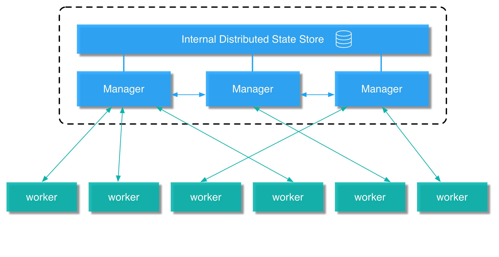

## Docker 1.12

Docker 1.12 設計基於四個原則：

- **簡易且功能豐富**：Orchestration 是現代分散式應用程式的核心，因為它能讓我們能完美建置在核心 Docker Engine 中，所以顯得重要。我們編排 orchestration 遵循 containers 的理念，不需安裝，只需學習數個簡單的概念與 "it just works" 的使用者體驗。

- **彈性**：機器都可以能任何時候發生故障，現代系統應該期望這些錯誤經常發生，並且設計一個合適的方式，當錯誤發生時，在無任何機器停止狀況下，持續提供服務。

- **安全**：安全是預設必要的，強大的安全機制、不必了解 PKI ，但高階使用者必須能控制與審查任何方面的驗證簽署與發佈。

- **選配功能與向後相容**：擁有數百萬使用者，保留 Docker Engine 向後相容是必要的。所有的新功能都是選配的，且假設你不使用，也不產生任何負載（記憶體、CPU）。