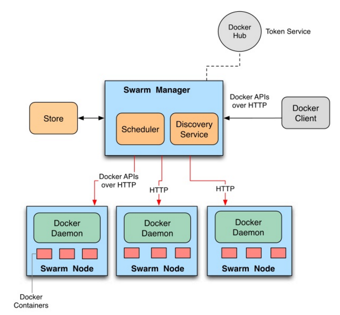

# Docker SwarmKit
*SwarmKit* 是一個策劃任何分散式系統的工具包，包含節點發現、 raft-based consensus 與任務調度...等功能。



其主要行為可分成：

- **分散式** : *SwarmKit* 為了協調與不依賴未能進行決策的單一節點，使用 raft consensus 演算法。
- **安全** : 在 *Swarm* 內節點間的通訊與成員都是安全的，*SwarmKit* 使用相互的 TLS 來達到節點驗證、角色授權與傳輸加密，自動化憑證發佈與輪轉。
- **簡易** : *SwarmKit* 操作上簡易且最小的基礎設施依賴，在操作上也不必額外的資料庫。

## 概觀

運行 *SwarmKit* 可群組所有機器形成一個 *Swarm* ，且彼此間可任意調度任務。一旦有一台機器加入，則它將成為 *Swarm* 的一員。節點可設為工作節點（*worker* node）或管理節點 (*manager* node)。

- **工作節點** 主要是透過執行器 (*Executor*) 執行任務 (Tasks)，*SwarmKit* 的預設執行器是 *Docker Container Executor* ，但若需調整也可輕易變動。
- **管理節點** 主要負責使用者的需求與回應，將叢集狀態調整成如使用者預期。

後續也可動態修改節點角色，如工作節點提升為管理節點，或管理節點降級為工作節點。

服務由任務組成。服務定義了需要被建立的任務種類、如何運行（如：隨時執行多個副本）與如何更新（如：[捲動更新](https://zh.wikipedia.org/wiki/%E6%BB%9A%E5%8A%A8%E6%9B%B4%E6%96%B0)）。

## 特性

- **服務編排**
	- **一致性** : *SwarmKit* 會不斷比對期望狀態與實際狀態，發現兩者不相符時（如：服務擴展、節點失效），則 *SwarmKit* 會自動將服務中的任務調度到其他節點。
	- **類型** : 目前 *SwarmKit* 支援兩種服務類型 :
		- **複製型服務** : *SwarmKit* 會在該節點上啟動預期數量的副本。
		- **全局服務** : *SwarmKit* 會在叢集上的各個可用節點執行一個任務。
	- **配置升級** : 任何時候你都可以修改服務的一個或多個配置檔。當你更新完後，*SwarmKit* 會協調期望狀態，確保所有的任務皆已使用期望的設定。預設情況下會同時執行升級。你可以使用不同的方式進行配置 :
		- **對比** : 定義同一時間可以執行多少的升級項目。
		- **延遲** : 設定最小更新延遲間隔時間。*SwarmKit* 等待上一個任務關閉後啟動，接著等待狀態為 RUNNING ，再等待額外配置的等待時間，最後，執行後續其他任務。
	- **重啟策略** : 使用者可自行定義重啟條件、延遲時間、限制（給定時間內最大的嘗試次數）。*SwarmKit* 可以決定在不同機器上重新啟動任務。換句話說，不合適的節點將被排除，不接受任何任務。
- **調度**
	- **資源感知** : *SwarmKit* 能察覺節點上的可用支援作為後續分配任務的依據。
	- **限制** : 使用者可定義限制表達式，限制任務所被調度的節點。限制可已對應多種節點的屬性，像是 IDs、名稱、標籤（如：`node.labels.foo!=bar1`）。
	- **策略** : 目前專案實現的調度策略為調度任務給負載最低的節點，提供合適的限制與資源需求。

##快速建置

| 節點名稱   | IP Address |
|:---------:|:----------:|
| manager-1 | 10.26.1.77 |
| worker-1  | 10.26.1.79 |


###環境要求 :

  - 已安裝 Docker

###Manager Node 安裝 :

```
$ ./manager-node.sh

```

>  執行 install 內的 manager-node.sh 且輸入 Manager Node 名稱進行快速安裝。

###Worker Node 安裝 :

```
$ ./worker-node.sh

```

>  執行 install 內的 worker-node.sh 且輸入 Worker Node 名稱與 Manager Node IP Address 進行快速安裝。

若成功安裝後，你可在 Manager Node 上執行查詢所有節點指令：

```
$ swarmctl node ls

ID                         Name       Membership  Status  Availability  Manager Status
--                         ----       ----------  ------  ------------  --------------
9aqyyb00e252y2rr39kldhh06  manager-1  ACCEPTED    READY   ACTIVE        REACHABLE *
brm3eaxfd2iz9aeqk02ecvihf  worker-1   ACCEPTED    READY   ACTIVE
```

##操作範例

### 配置 Swarm

這裡假設你已經將 `swarmd` 與 `swarmctl` 設定在 PATH 內。

（啟動之前，確認 `/tmp/node-N` 不存在）

初始化第一個節點 :

```
$ swarmd -d /tmp/node-1 --listen-control-api /tmp/manager1/swarm.sock --hostname node-1
```

> 這裡的 node-1 、 manager1 可依照使用者需求自行定義。

打開兩個額外的 terminals ，加入兩個節點（注意：使用你第一個節點的 IP Address 取代 `127.0.0.1`）

```
$ swarmd -d /tmp/node-2 --hostname node-2 --join-addr 127.0.0.1:4242
$ swarmd -d /tmp/node-3 --hostname node-3 --join-addr 127.0.0.1:4242
```

> 這裡的 node-2 與 node-3 可依照使用者需求自行定義。

開啟第四個 terminal ，使用 `swarmctl` 操作與控制叢集。在使用 swarmctl 前，將 `SWARM_SOCKET` 設定到環境變數中，啟動時 manager socket 會被指定到 `--listen-control-api`。

顯示節點列表 :

```
$ export SWARM_SOCKET=/tmp/manager1/swarm.sock
$ swarmctl node ls
ID             Name    Membership  Status  Availability  Manager status
--             ----    ----------  ------  ------------  --------------
15jkw04qb4yze  node-1  ACCEPTED    READY   ACTIVE        REACHABLE *
1zbwraf2v8hpx  node-3  ACCEPTED    READY   ACTIVE        
3vj01av6782qn  node-2  ACCEPTED    READY   ACTIVE   
```     

###建立服務（Services）

啟動 *redis* 服務 :

```
$ swarmctl service create --name redis --image redis:3.0.5
89831rq7oplzp6oqcqoswquf2
```

列出正在執行的服務 :

```
$ swarmctl service ls
ID                         Name   Image        Replicas
--                         ----   -----        ---------
89831rq7oplzp6oqcqoswquf2  redis  redis:3.0.5  1
```

檢視服務 :

```
$ swarmctl service inspect redis
ID                : 89831rq7oplzp6oqcqoswquf2
Name              : redis
Replicass         : 1
Template
 Container
  Image           : redis:3.0.5

Task ID                      Service    Instance    Image          Desired State    Last State               Node
-------                      -------    --------    -----          -------------    ----------               ----
0dsiq9za9at3cqk4qx07n6v8j    redis      1           redis:3.0.5    RUNNING          RUNNING 2 seconds ago
```

###更新服務

你可以任意更新服務的屬性。

例如，你可以擴充服務，改變實例的數量 :

```
$ swarmctl service update redis --replicas 6
89831rq7oplzp6oqcqoswquf2

$ swarmctl service inspect redis
ID                : 89831rq7oplzp6oqcqoswquf2
Name              : redis
Replicas          : 6
Template
 Container
  Image           : redis:3.0.5

Task ID                      Service    Instance    Image          Desired State    Last State               Node
-------                      -------    --------    -----          -------------    ----------               ----
0dsiq9za9at3cqk4qx07n6v8j    redis      1           redis:3.0.5    RUNNING          RUNNING 1 minute ago     node-1
9fvobwddp5ve3k0f4al1mhuhn    redis      2           redis:3.0.5    RUNNING          RUNNING 3 seconds ago    node-2
e7pxax9mhjd4zamohobefqpy0    redis      3           redis:3.0.5    RUNNING          RUNNING 3 seconds ago    node-2
ceuwhcffcavur7k9q57vqw0zg    redis      4           redis:3.0.5    RUNNING          RUNNING 3 seconds ago    node-1
8vqmbo95l6obbtb7fpmvz522f    redis      5           redis:3.0.5    RUNNING          RUNNING 3 seconds ago    node-3
385utv15nalm2pyupao6jtu12    redis      6           redis:3.0.5    RUNNING          RUNNING 3 seconds ago    node-3
```

為了如使用者預期變更 replicas 由 1 到 6 ，且強制 SwarmKit 加入五個額外的任務。

也可以改變其他的參數，如 image 、 args 、 env ...等

這裡將更改 image 由 redis:3.0.5 升級到 redis:3.0.6

```
$ swarmctl service update redis --image redis:3.0.6
89831rq7oplzp6oqcqoswquf2

$ swarmctl service inspect redis
ID                : 89831rq7oplzp6oqcqoswquf2
Name              : redis
Replicas          : 6
Template
 Container
  Image           : redis:3.0.6

Task ID                      Service    Instance    Image          Desired State    Last State                Node
-------                      -------    --------    -----          -------------    ----------                ----
7947mlunwz2dmlet3c7h84ln3    redis      1           redis:3.0.6    RUNNING          RUNNING 34 seconds ago    node-3
56rcujrassh7tlljp3k76etyw    redis      2           redis:3.0.6    RUNNING          RUNNING 34 seconds ago    node-1
8l7bwrduq80pkq9tu4bsd95p4    redis      3           redis:3.0.6    RUNNING          RUNNING 36 seconds ago    node-2
3xb1jxytdo07mqccadt06rgi0    redis      4           redis:3.0.6    RUNNING          RUNNING 34 seconds ago    node-1
16aate5akcimsye9cp5xis1ih    redis      5           redis:3.0.6    RUNNING          RUNNING 34 seconds ago    node-2
dws408a3gz0zx0bygq3aj0ztk    redis      6           redis:3.0.6    RUNNING          RUNNING 34 seconds ago    node-3
```

預設所有的任務將同時更新。

可以重新定義更新選項進行調整。

在這個實例中，更改任務 2 在更新後等待 10 秒。

```
$ swarmctl service update redis --image redis:3.0.7 --update-parallelism 2 --update-delay 10s
$ watch -n1 "swarmctl service inspect redis"  # watch the update
```

這裡將先更新兩個任務，等待它們狀態為 *RUNNING* ，並且等待額外的 10 秒鐘期間，再進行其他任務的更新。

更新選項可以設定服務的新增或更新延遲時間，若更新命令未指定更新選項，則選項將使用最後一個設定。

###節點管理

*SwarmKit* 監控節點的正常狀況，假設這裡有一個故障的節點，*SwarmKit* 會將該故障節點的任務調度到其他節點。

使用者也可以手動定義可使用的節點，或者設定節點狀態為停止或排除。

這裡讓我們把 `node-1` 改成維修模式 :

```
$ swarmctl node drain node-1

$ swarmctl node ls
ID             Name    Membership  Status  Availability  Manager status
--             ----    ----------  ------  ------------  --------------
2o8evbttw2sjj  node-1  ACCEPTED    READY   DRAIN         REACHABLE
2p7w0q83jargg  node-2  ACCEPTED    READY   ACTIVE        REACHABLE *
3ieflj99g4wh8  node-3  ACCEPTED    READY   ACTIVE        REACHABLE

$ swarmctl service inspect redis
ID                : 89831rq7oplzp6oqcqoswquf2
Name              : redis
Replicas          : 6
Template
 Container
  Image           : redis:3.0.7

Task ID                      Service    Instance    Image          Desired State    Last State               Node
-------                      -------    --------    -----          -------------    ----------               ----
2pbjiykmaltiujokm0r8hmpz4    redis      1           redis:3.0.7    RUNNING          RUNNING 1 minute ago     node-2
az8ias15auf6w11jndsk7bc2o    redis      2           redis:3.0.7    RUNNING          RUNNING 1 minute ago     node-3
5gsogy426bnqxdfynheqcqdls    redis      3           redis:3.0.7    RUNNING          RUNNING 4 seconds ago    node-2
6vfzoshzb4jhyvp59yuf4dtnj    redis      4           redis:3.0.7    RUNNING          RUNNING 5 seconds ago    node-3
18p0ei3a43xermxsnvvv0v1vd    redis      5           redis:3.0.7    RUNNING          RUNNING 2 minutes ago    node-2
70eln8ibd8aku6jvmu8xz3hbc    redis      6           redis:3.0.7    RUNNING          RUNNING 4 seconds ago
```

在這裡你能明確的看到，所有原本執行在 `node-1` 上的任務皆被轉移到另外的 `node-2` 與 `node-3` ，達到負載平衡。

##參考

[SwarmKit](https://github.com/docker/swarmkit)
